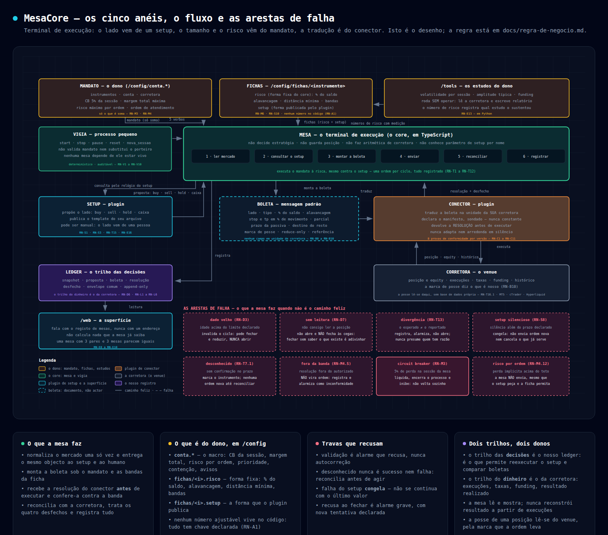

# MesaCore

**Um terminal de execução de ordens.** O lado da operação vem de um *setup*; o tamanho, o risco e o
limite vêm de um *mandato* e de *fichas* que o dono escreve; a tradução para a linguagem da corretora
vem de um *conector*. Entre os três, a mesa preenche uma *boleta* e leva-a ao venue, reconcilia,
registra e trata o desfecho.

Este repositório **não é o motor que opera** — é o desenho, a regra e (a seguir) as especificações de
um terminal limpo, com as fronteiras declaradas desde a primeira linha. O valor que se tira deste
projeto é o **know-how de execução de ponta a ponta**: como uma decisão vira uma ordem que a corretora
aceita, como se sabe que ela existe, e o que se faz quando não se sabe.



## A ideia em uma frase

O sistema tem uma parte **burra e determinística** — normalizar mercado, preencher a boleta, enviar,
reconciliar, registrar — e uma parte **inteligente e humana** — decidir lado, tamanho, risco, stop. A
inteligência não vive no código: vive em **arquivos de configuração** que o dono edita, e o terminal
executa o que ali está **à risca**, podendo **sempre dizer não**.

**Nenhum número ajustável está no código.** Um mandato pode querer 2% de risco e um outro 0,5% — os
dois são o mesmo programa, com chaves diferentes (`RN-A1`). Um inventário de chaves é validado no
arranque: chave que ninguém lê é lixo, valor lido sem chave é defeito (`RN-A2`).

## Os cinco anéis

| Anel | Decide | NUNCA faz |
|---|---|---|
| **Mandato** (o dono, `/config`) | instrumentos, corretora e conta, perda máxima da sessão, margem total máxima, risco máximo por ordem, ordem de atendimento | não decide estratégia, nem lado, nem stop |
| **Mesa** (o core, em TypeScript) | normaliza, consulta, preenche a boleta, envia, reconcilia, registra | não escolhe lado nem tamanho; não faz aritmética de corretora; não guarda posição |
| **Setup** (plugin) | o lado (buy · sell · hold · caixa) **e a estratégia pelo seu template** | não vê tamanho, risco, execução nem a corretora |
| **Boleta** | — | é documento, não actor: não decide, não é campo de origem |
| **Conector** (plugin) | traduz a boleta nas unidades da **sua** corretora e devolve a **resolução antes de executar** | não altera lado nem momento; nunca adapta nem arredonda em silêncio |

Duas consequências que explicam quase todo o resto:

- **O core não conhece nenhum parâmetro de estratégia por nome.** Um setup com stop e um setup sem
  stop são o mesmo tipo de plugin: o que a mesa lê é o **template** que cada um publica. É isto que
  impede o core de engessar os setups — e é por isso que as variantes de um setup são apenas **fichas**.
- **Nada em unidade de corretora atravessa a fronteira.** A boleta fala em percentagem do saldo,
  alavancagem e percentagens de movimento; quantidade, lote e preço absoluto são do conector, que os
  **declara antes** de executar para que a mesa possa recusar.

## O que a mesa faz quando não é o caminho feliz

Isto é metade do desenho. Validação é **alarme que recusa, nunca autocorreção**: nada se arredonda,
nada se presume, nada se preenche em silêncio.

- **dado velho** — invalida o ciclo: pode fechar e reduzir, nunca abrir;
- **sem leitura** — não se abre e não se fecha às cegas: fechar sem saber o que existe é adivinhar;
- **divergência** — o esperado ≠ o reportado: registra, alarmiza, não presume quem tem razão;
- **desconhecido** — sem confirmação no prazo, nenhuma ordem nova até reconciliar;
- **fora da banda** — a resolução que o dono não autorizou não vira ordem: é inconformidade;
- **setup silencioso** — congela; não se continua com o último valor;
- **circuit breaker da sessão** — liquida, encerra o processo e fica inibido: não volta sozinho.

## Estrutura

```
/contracts      as portas: setup, conector, objecto normalizado, boleta, desfecho (schema neutro)
/core           a mesa (ciclo, boleta, ledger, mandato, servidor) e o vigia
/setups/<nome>  o plugin, o template de configuração, o schema do seu estado, os testes
/brokers/<nome> o conector, o manifesto, a bateria de conformidade, as fixtures
/config         os arquivos do dono: config macro da conta e fichas (risco + setup)
/tools          os estudos do dono sobre um instrumento, sem operar
/web            a superfície
/specs/<NNN>-…  as especificações por recorte (Spec Kit) e a checklist de cada uma
/docs           a regra de negócio, a máquina de estados, o inventário de chaves, o diagrama
```

**Dois trilhos, dois donos.** O trilho das **decisões** é o nosso ledger — snapshot, proposta, boleta,
resolução, desfecho: é o que permite re-correr o setup e comparar boletas. O trilho do **dinheiro** —
execuções, taxas, funding, resultado realizado — é o da **corretora**, que já o faz por ofício: a mesa
lê e mostra, **nunca reconstrói resultado**.

**Onde está a posição?** Na corretora, não numa base de dados nossa: cada ordem leva uma **marca de
posse**, e é por ela que a mesa reconhece, ao reiniciar, o que é seu. Posição que a mesa não abriu é
vista, não gerida.

Regra de dependência: setups e brokers importam `contracts`; `core` importa `contracts`; **ninguém
importa `core`** (verificado por teste).

## Estado

| Documento | O que é |
|---|---|
| `docs/regra-de-negocio.md` | **a fonte da verdade** — 136 regras em 10 famílias (`RN-A` chaves, `RN-B` boleta, `RN-C` conector, `RN-D` dados, `RN-E` estrutura, `RN-L` ledger, `RN-M` mandato, `RN-S` setup, `RN-T` mesa, `RN-V` vigia) |
| `docs/maquina-de-estados.md` | os eixos da mesa, das condições do instrumento e da posição, as marcas persistidas e as portas do arranque |
| `docs/inventario-de-chaves.md` | cada grandeza ajustável: dono, tipo, omissão e **quem a lê** |
| `docs/diagrama-de-blocos.html` · `.png` | o desenho dos anéis, do fluxo e das arestas de falha |
| `.specify/memory/constitution.md` | a **constituição** (v1.0.0): os oito princípios não negociáveis, cada um com o **teste que o recusa** |

Especificações: a **primeira tem spec, plano e tarefas** — `specs/001-contrato-neutro/` (o contrato
neutro: as mensagens, os mocks dos dois lados e as provas de fronteira), com a checklist de qualidade, a
pesquisa (`research.md`, 12 decisões com alternativas rejeitadas), o desenho (`data-model.md`,
`contracts/interface.md`), o guia de validação (`quickstart.md`) e as 59 tarefas (`tasks.md`). As
seguintes vêm por recorte, cada uma referenciando as regras `RN-*`.

**Onde está o que já se mediu:** `specs/001-contrato-neutro/relatorios/RESULTADO.md` — cada critério de
sucesso com o comando que o mediu e a saída. É o primeiro documento a ler para saber em que pé está o
projecto.

## Ordem de trabalho

1. Regra de negócio detalhada — feita (v3, com a revisão de lacunas).
2. Máquina de estados, inventário de chaves e diagrama — feitos; são as vistas que revelaram as lacunas
   que a prosa não revelava.
3. Constituição do projeto (Spec Kit) — feita, derivada da regra.
4. Especificações por recorte: **o contrato está especificado** (`specs/001-contrato-neutro`); seguem-se
   mandato, boleta, mesa, ledger, setup de referência e conector.
5. Implementação, contra os vectores de aceite do motor antigo.

## Referência

O motor que roda hoje (`~/Projects/jev-trade-fusao`, repo `hl-jev`) é **fonte de consulta**, citado por
`arquivo:linha` — não é base de código a copiar. Serve para os casos que só se sabem por ter corrido
contra a corretora de verdade, e continua a operar a conta até este terminal passar nos vectores de
aceite. O comportamento dele é o **oráculo de aceite**: medido, não opinado.

---

## O que existe hoje (recorte 002 — a máquina de estados)

> **Nota de estado (29/09/2026).** Esta secção é do recorte 002 e não acompanhou os que se seguiram: a máquina
> de estados (002) e o **vigia** (003) estão fechados, e o **conector Hyperliquid** (004) está implementado e
> medido — contrato **1.5.0**, `provar.sh` **27 de 27**, **68 das 71** tarefas do 004 fechadas (as 3 abertas
> exigem **enviar** ordem ao venue, e não há código que envie). O retrato medido, com o comando de cada número,
> está em **`docs/ONDE_ESTAMOS.md`** — é esse o documento a abrir primeiro, não esta tabela.

| Pasta | O que é |
|---|---|
| `contracts/` | **normativo** (recorte 001, fechado): 9 schemas, vocabulário, mocks das duas pontas, bateria de 81 casos nas duas linguagens |
| `core/` | a mesa: a tabela, o intérprete, o ciclo, o relógio, as marcas, o registo. **Decide e não envia** |
| `vigia/` | **a camada de operação** (recorte 003): uma linha entra e uma sai; arranca a mesa e os conectores como **processos**, corre as sete portas, guarda o registro da operação. Não decide risco, nem estado, nem marcas |
| `tools/verificar-maquina/` | as bancadas da mesa (tabela, arranque, sessão, pausa, registo, chaves) |
| `tools/verificar-contrato/` | as do contrato (001): ponta-a-ponta, frescura, inventário, porta da dependência |
| `specs/001-contrato-neutro/` | a spec do contrato — **59/59 tarefas**, fechada |
| `specs/002-maquina-de-estados/` | a spec da máquina — 7 histórias, 44 FR, 12 SC. Relatórios em `relatorios/` |
| `docs/` | a regra de negócio (136), a máquina de estados, o inventário de chaves |

**Uma porta para provar tudo:** `bash tools/verificar-maquina/provar.sh` (**34 de 34**, medido 02/10/2026 — o
"15 de 15" que aqui estava era do recorte 002 e tinha ficado para trás; o número verdadeiro lê-se sempre na
última linha da própria porta).

**O que o recorte 002 se recusa a fazer:** arredondar percentagens para comparar com um limite; corrigir o
que entrou errado (recusa e diz porquê); avisar por omissão quando a lista do dono não existe; tratar
silêncio do venue como aceite; e esperar por uma resposta que não vem.
